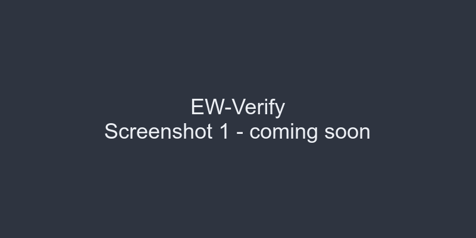
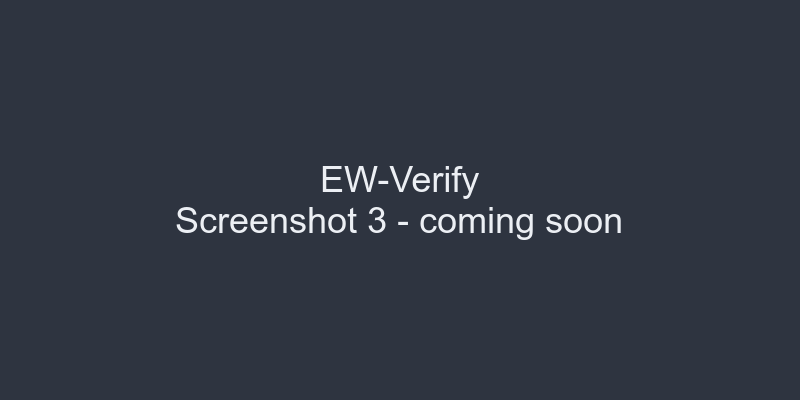

# EW-Verify

Purple Team adversarial validation suite for Electronic Warfare detection capabilities on Linux.

[](https://kernel.org)
[](https://gcc.gnu.org/)
[](LICENSE)
[](#-roadmap)
[](https://github.com/jeffersoncesarantunes/EW-Verify/actions/workflows/ci.yml)
[](https://github.com/jeffersoncesarantunes/EW-Verify/actions/workflows/codeql.yml)
[](Dockerfile)
[](https://security.archlinux.org/)
[](#-overview)


---

## Etymology & Origin

The name **EW-Verify** stands for **Electronic Warfare Verify** — it validates whether a Linux system can detect, report, or survive electronic attack scenarios. The "EW" prefix signals a departure from pure host forensics into the electromagnetic and wireless domain, while "Verify" preserves the adversarial validation DNA inherited from **K-Verify**.

Where K-Verify tests memory-level attack detection (RWX, process hiding, ASLR bypass), EW-Verify tests the RF and wireless attack surface: jamming, spoofing, deauthentication, and spectrum manipulation.


---

## Overview

EW-Verify is a Purple Team adversarial validation tool built to stress-test the detection layer for Electronic Warfare attack scenarios on Linux systems.

It runs controlled adversarial actions in the wireless and electromagnetic spectrum, then cross-references each one against the kernel and RF interfaces that detection tools rely on. Every scenario maps to a **MITRE ATT&CK** technique or an **EW taxonomy** classification, and the final report includes a **Detection Gap Analysis** that points out blind spots nobody's covering.

The tool covers several core areas. It launches deauthentication attacks against test networks and checks whether the kernel's wireless stack (nl80211/cfg80211) reports them. It attempts GPS spoofing and assesses system-side detection (if GPS hardware is present). It floods Bluetooth and Wi-Fi channels and monitors for kernel-level interference signals. It checks RFkill state, wireless regulatory domain constraints, and spectrum congestion indicators. When live detection tools are available (like Wireshark, aircrack-ng suite, or custom SDR-based sensors), it can invoke them for true end-to-end validation. Every scenario is tagged with its MITRE ATT&CK technique ID or EW category, and the detection gap analysis counts how many scenarios no tool covers.


---

## Features

EW-Verify comes with ten adversarial scenarios across the electromagnetic spectrum. You get wireless deauthentication testing via `--deauth` that sends 802.11 deauth frames and checks kernel detection. GPS spoofing simulation with `--gps-spoof` validates whether the system or connected applications detect forged NMEA data. Bluetooth attack scenarios with `--bt-attack` test for flood and pairing-based attacks. Spectrum congestion analysis with `--spectrum` reads RF signal density indicators. RFkill state verification with `--rfkill` checks whether the kernel's RF kill switch is engaged. Wi-Fi regulatory domain assessment with `--regulatory` validates country code and channel restrictions. Aireplay-ng integration with `--aireplay` runs actual aireplay-ng attacks and checks for detection. There's an SDR readiness check with `--sdr` that validates whether RTL-SDR or HackRF devices are available and functional. Output goes to a color-coded Purple Team validation matrix on the terminal, and you can also export structured JSON or CSV for your reporting pipeline. The **Detection Gap Analysis** calls out blind spots where no tool provides coverage. **MITRE ATT&CK** and **EW taxonomy** IDs show up in terminal output, JSON, and CSV. There's a **Silent JSON mode** (`--json`) that suppresses the banner entirely for CI/CD pipelines. The engine is modular C99 — each scenario lives in its own source file. There's an automated unit test suite via `make test`, a CI/CD pipeline through GitHub Actions, a read-only verification phase that assesses system state without running any attacks, and full child process lifecycle management with a cleanup mode.


---

## MITRE ATT&CK & EW Taxonomy Mapping

Every scenario is mapped to a real MITRE ATT&CK technique or Electronic Warfare category:

| Scenario | ID | Description |
|---|---|---|
| DEAUTH_ATTACK | [T1562.001](https://attack.mitre.org/techniques/T1562/001/) | Impair Defenses: Disable or Modify Tools |
| GPS_SPOOF | [T1557](https://attack.mitre.org/techniques/T1557/) | Adversary-in-the-Middle |
| BT_FLOOD | [T1498](https://attack.mitre.org/techniques/T1498/) | Network Denial of Service |
| SPECTRUM_SCAN | EW-ES-001 | Electronic Support — Spectrum Monitoring |
| RFKILL_STATE | EW-EP-001 | Electronic Protection — RF Kill Assessment |
| REGULATORY_CHECK | EW-EP-002 | Electronic Protection — Regulatory Compliance |
| AIREPLAY_ATTACK | T1562.001 | Impair Defenses: Disable or Modify Tools |
| SDR_READINESS | EW-ES-002 | Electronic Support — SDR Capability |
| WIFI_JAM | T1498 | Network Denial of Service |
| CHANNEL_HOP | EW-EA-001 | Electronic Attack — Channel Hopping |

Technique IDs are embedded in terminal output, JSON exports, and CSV reports.


---

## Example Output

```
        ╔═══════════════════════════════════════════════════════╗
        ║     EW-Verify | Purple Team - Electronic Warfare      ║
        ╚═══════════════════════════════════════════════════════╝

  ════════════════════════════════════════════════════════════════
    RUN SEQUENCE INITIATED
  ════════════════════════════════════════════════════════════════

  [01/10] DEAUTH_ATTACK    PASS  [EW:✔  KS:✘]  T1562.001
  [02/10] GPS_SPOOF        SKIP  (no GPS device)
  [03/10] BT_FLOOD         WARN  (BT not powered)
  [04/10] SPECTRUM_SCAN    WARN  (no wireless interfaces)
  [05/10] RFKILL_STATE     SKIP  (rfkill not available)
  [06/10] REGULATORY_CHECK WARN  (no regulatory info)
  [07/10] AIREPLAY_ATTACK  SKIP  (aireplay-ng not found)
  [08/10] SDR_READINESS    PASS  (SDR tools found, no device)  [EW:✔  KS:✘]  EW-ES-002
  [09/10] WIFI_JAM         SKIP  (no jamming tools found)
  [10/10] CHANNEL_HOP      SKIP  (no wireless interface)

  ════════════════════════════════════════════════════════════════
    RESULTS
  ════════════════════════════════════════════════════════════════

  [01/10] DEAUTH_ATTACK      PASS  [EW:✔  KS:✘]  T1562.001
  [02/10] GPS_SPOOF          SKIP  [EW:✘  KS:✘]  T1557
  [03/10] BT_FLOOD           WARN  [EW:✘  KS:✘]  T1498
  [04/10] SPECTRUM_SCAN      WARN  [EW:✘  KS:✘]  EW-ES-001
  [05/10] RFKILL_STATE       SKIP  [EW:✘  KS:✘]  EW-EP-001
  [06/10] REGULATORY_CHECK   WARN  [EW:✘  KS:✘]  EW-EP-002
  [07/10] AIREPLAY_ATTACK    SKIP  [EW:✘  KS:✘]  T1562.001
  [08/10] SDR_READINESS      PASS  [EW:✔  KS:✘]  EW-ES-002
  [09/10] WIFI_JAM           SKIP  [EW:✘  KS:✘]  T1498
  [10/10] CHANNEL_HOP        SKIP  [EW:✘  KS:✘]  EW-EA-001

  ═════════════════════════════════════════════════════════════════
    FINAL ASSESSMENT
  ════════════════════════════════════════════════════════════════

   [█████░░░░░]  5/10  (50%)  adversarial actions succeeded
   [██░░░░░░░░]  2/10  (20%)  detected by EW-Sensor
   [░░░░░░░░░░]  0/10  (0%)  detected by Kernel
   [████████░░]  8/10  (80%)  unmonitored gaps (no EW or KS coverage)

   STATUS:  Purple Team Validation Complete
  ════════════════════════════════════════════════════════════════
```


---

## How It Works

EW-Verify runs in three phases.

### Phase 1: Adversarial Execution

Each scenario executes a controlled electronic attack or measurement. DEAUTH_ATTACK sends 802.11 deauthentication frames using `iw` or `aireplay-ng`. GPS_SPOOF injects forged NMEA sentences into the GPS device stream. BT_FLOOD floods Bluetooth L2CAP packets. SPECTRUM_SCAN reads signal level indicators from `/proc/net/wireless` or `iw dev`. RFKILL_STATE queries `/sys/class/rfkill/*`. REGULATORY_CHECK reads `iw reg get`. AIREPLAY_ATTACK runs aireplay-ng in test mode. SDR_READINESS probes for RTL-SDR or HackRF devices via USB. WIFI_JAM floods a target channel with noise frames. CHANNEL_HOP rapidly cycles through Wi-Fi channels while measuring signal changes.

### Phase 2: Detection

For every scenario, EW-Verify queries the same kernel and RF interfaces a detection tool would read. On the kernel path, it checks `/sys/class/rfkill/`, `/proc/net/wireless`, `iw event` traces, and `dmesg` for wireless driver alerts. On the EW sensor path, it checks for spectrum analyzer output, SDR sample captures, or external detector logs. You don't need any external detection tools installed to run EW-Verify. The detection logic is baked directly into EW-Verify's source code: it reads the same interfaces they would and *predicts* whether they'd fire. If you pass `--live`, it optionally invokes actual tools (Wireshark, aircrack-ng, custom SDR detectors) for real validation.

### Phase 3: Correlation

Results come out as a validation matrix. You get to see whether the adversarial action succeeded, whether each detection tool would detect it, and the MITRE ATT&CK or EW taxonomy ID. There's a summary with progress bars for adversarial success rate, detection coverage, and unmonitored gaps.

### Detection Gap Analysis

The final assessment includes a metric called **unmonitored gaps** — scenarios where no detection tool provides coverage. Those are your highest-risk blind spots in the electromagnetic domain.


---

## Build and Run

```bash
# Clone the repository
git clone https://github.com/jeffersoncesarantunes/EW-Verify.git
cd EW-Verify

# Build the project
make

# (Optional) Clean rebuild from scratch
make clean && make

# Run the test suite
make test

# Run all scenarios with default terminal output
sudo ./ewverify

# Run all scenarios with silent JSON export (no banner, CI/CD ready)
sudo ./ewverify --json

# Export results to CSV
sudo ./ewverify --csv

# Run a specific module
sudo ./ewverify --deauth
sudo ./ewverify --gps-spoof
sudo ./ewverify --bt-attack
sudo ./ewverify --spectrum
sudo ./ewverify --rfkill
sudo ./ewverify --regulatory
sudo ./ewverify --aireplay
sudo ./ewverify --sdr
sudo ./ewverify --wifi-jam
sudo ./ewverify --channel-hop

# Run with live detection tool integration
sudo ./ewverify --live

# Read-only verification (no adversarial actions)
sudo ./ewverify --verify-only

# Clean up any remaining child processes
sudo ./ewverify --cleanup

# Check available hardware and tools before running
sudo ./ewverify --check-req
```

### External Dependencies

Some scenarios require optional external tools:

```bash
# For wireless deauth and aireplay scenarios
sudo pacman -S aircrack-ng

# For Bluetooth attack scenarios
sudo pacman -S bluez bluez-utils

# For SDR readiness check
sudo pacman -S rtl-sdr hackrf
```

When `--json` is used alone, the tool skips the banner and terminal output entirely and writes only the JSON report file. This is meant for automated pipelines, cron jobs, and CI/CD integration.


---

## Post-Analysis & Report Viewing

Once reports are generated, you can inspect them right from the terminal:

```bash
# View aligned and formatted CSV results (top 15 results)
column -t -s ',' ewverify-report.csv | head -n 16

# Quickly inspect the structured JSON output header
cat ewverify-report.json | head -n 15
```


---

## Project in Action

Screenshots are reserved for a future visual walkthrough. The images directory contains assets that will be referenced here once the walkthrough is finalized.


---

## Operational Integrity

EW-Verify is designed for controlled adversarial testing. All wireless attacks target test interfaces only — never production networks. Child processes are tracked and reaped. The `--cleanup` mode kills any remaining children. `--verify-only` does a read-only assessment. There are no persistent system modifications and no lateral movement. Every action is logged transparently. Use in isolated, authorized lab environments only.


---

## Deployment

### Requirements

You'll need a Linux kernel 5.x or newer, gcc, make, and root privileges for wireless interface access and RF tests. A wireless adapter supporting monitor mode helps for deauth and jamming scenarios. A UTF-8 compatible terminal is recommended. Optionally you'll want aircrack-ng for `--aireplay`, bluetoothctl for `--bt-attack`, and rtl-sdr/hackrf tools for `--sdr`.


---

## Repository Structure

```text
├── .github/workflows/
│   ├── ci.yml
│   └── codeql.yml
├── build/
│   └── obj/
├── docs/
│   ├── EW_SCENARIOS.md
│   ├── EW_TAXONOMY.md
│   └── EW_VALIDATION_PROTOCOL.md
├── Images/
│   ├── ewverify1.png
│   ├── ewverify2.png
│   └── ewverify3.png
├── include/
│   ├── colors.h
│   ├── ewverify.h
│   └── modules.h
├── reports/
├── scenarios/
│   ├── deauth.c
│   ├── gps_spoof.c
│   ├── bt_attack.c
│   ├── spectrum.c
│   ├── rfkill.c
│   ├── regulatory.c
│   ├── aireplay.c
│   ├── sdr_check.c
│   ├── wifi_jam.c
│   └── channel_hop.c
├── src/
│   ├── main.c
│   ├── utils.c
│   └── verify.c
├── tests/
│   ├── .gitkeep
│   └── test_utils.c
├── .clang-format
├── .gitignore
├── LICENSE
├── Makefile
└── README.md
```


---

## Project in Action



*Purple Team validation matrix with MITRE ATT&CK and EW taxonomy references.*


*Spectrum congestion and RF signal density assessment output.*



*Detection Gap Analysis with cross-referenced blind spots in the electromagnetic domain.*


---

## Tech Stack

The language is C99. Data sources are `/sys`, `/proc`, `iw`, `rfkill`, and USB device enumeration. The build tool is GNU Make. The test framework is a custom C test harness. Target platforms are Linux Kernel 5.x and 6.x with wireless and Bluetooth support.


---

## Roadmap


- [x] Modular C99 engine with deauth, gps, bt, and spectrum modules
- [x] Verification engine cross-referencing EW sensor and kernel interfaces
- [x] Color-coded terminal validation matrix
- [x] JSON/CSV structured export with MITRE ATT&CK and EW taxonomy IDs
- [x] Detection Gap Analysis (unmonitored blind spots)
- [x] Silent JSON mode for CI/CD pipelines
- [x] `--verify-only` read-only assessment mode
- [ ] RFkill-based detection validation (`--rfkill`)
- [ ] Regulatory domain enforcement validation (`--regulatory`)
- [ ] Live tool integration (`--live`)
- [ ] SDR device readiness check (`--sdr`)
- [ ] Wi-Fi channel hopping detection (`--channel-hop`)
- [ ] Automated test suite (`make test`)
- [ ] CI/CD pipeline (GitHub Actions)
- [ ] eBPF-based wireless syscall telemetry
- [ ] Container-aware scenario execution


---

## Documentation

[](./docs/EW_TAXONOMY.md)
[](./docs/EW_SCENARIOS.md)
[](./docs/EW_VALIDATION_PROTOCOL.md)
